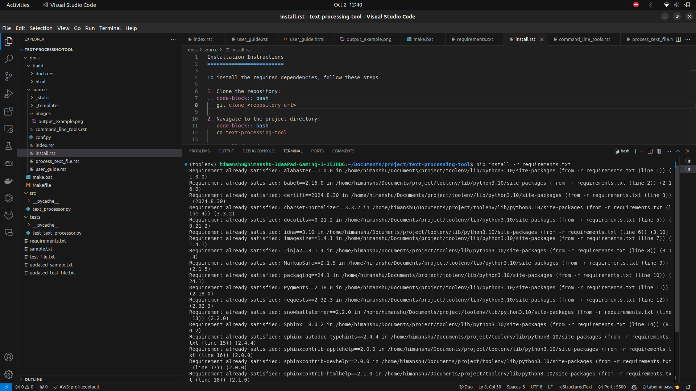

Installation Instructions
=========================

To install the required dependencies, follow these steps:

1. Clone the repository:

   .. code-block:: bash

      git clone <repository_url>

2. Navigate to the project directory:

   .. code-block:: bash

      cd text-processing-tool

3. Install dependencies:

   .. code-block:: bash

      pip install -r requirements.txt

Below is a screenshot of the installation process:

