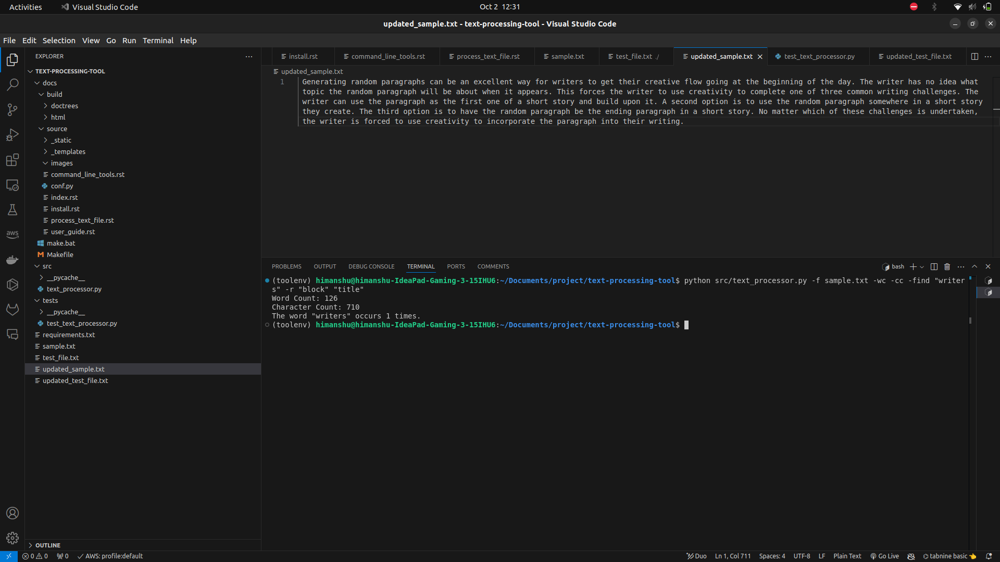

User Guide
==========

The Text Processor Tool allows users to count words, characters, and lines, find and replace words in text files.

Example usage:
--------------
Run the program with the following command:

.. code-block:: bash

   python text_processor.py -f sample.txt -wc -cc -find "example" -r "old" "new"

Features:
---------
- Word Count
- Character Count
- Line Count
- Find and Replace Words

Here is a screenshot of the output displayed in the terminal:

